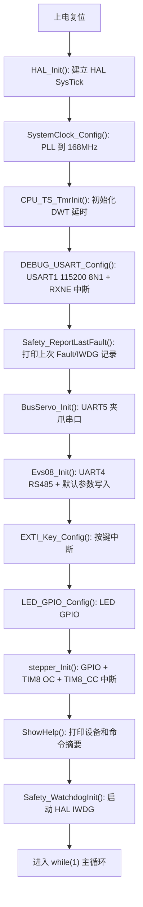
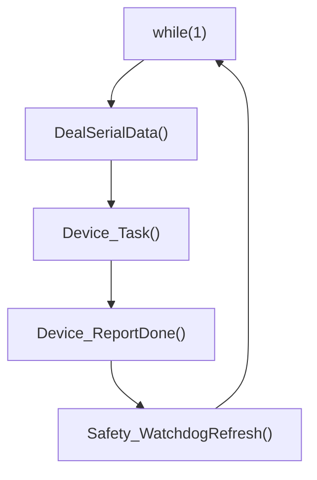
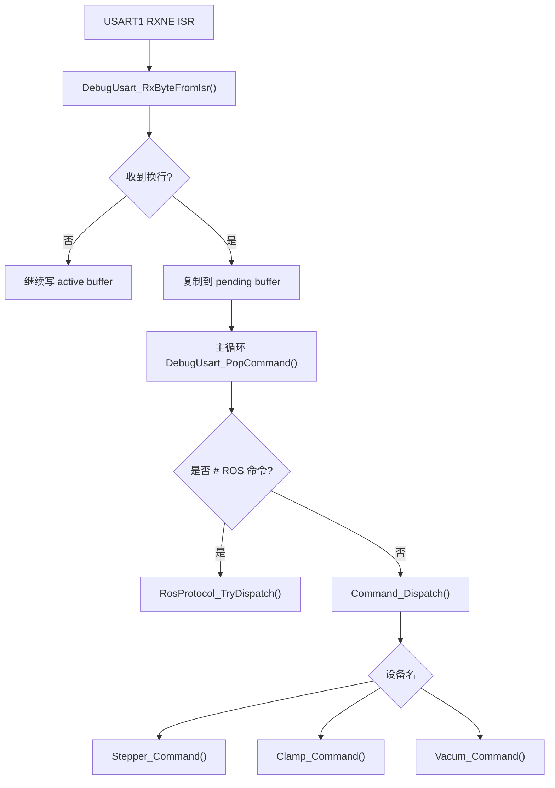
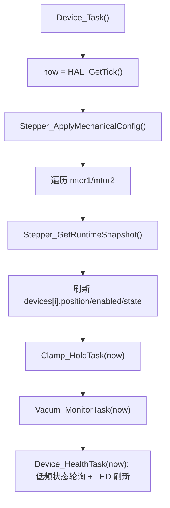
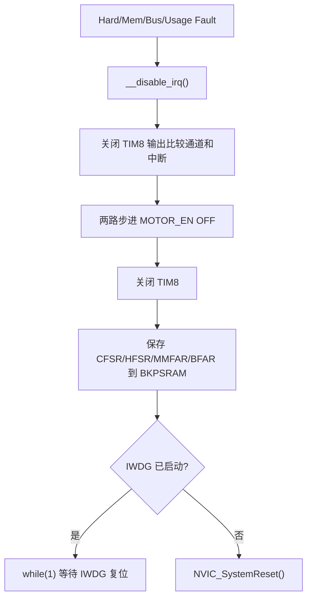

# STM32 内部功能与程序流程说明

本文说明当前 STM32F407 工程内部配置和程序流程，包括编译设置、时钟、定时器、中断、初始化、主循环、`Device_Task()`、USART 命令解析、ROS 协议和运行安全机制。

## 工程和编译设置

开发环境：

- Keil MDK。
- ARM Compiler 5。
- 工程文件：`Project/Fire-F407.uvprojx`。
- 当前 `Misc Controls` 使用 `--no-multibyte-chars`，用于避免中文字符串导致 ARMCC 多字节字符编译报错。

当前保留的 HAL 模块宏在 `User/stm32f4xx_hal_conf.h`：

```c
#define HAL_MODULE_ENABLED
#define HAL_FLASH_MODULE_ENABLED
#define HAL_GPIO_MODULE_ENABLED
#define HAL_IWDG_MODULE_ENABLED
#define HAL_PWR_MODULE_ENABLED
#define HAL_RCC_MODULE_ENABLED
#define HAL_TIM_MODULE_ENABLED
#define HAL_UART_MODULE_ENABLED
#define HAL_CORTEX_MODULE_ENABLED
#define HAL_DMA_MODULE_ENABLED
```

说明：

- `GPIO`、`RCC`、`PWR`、`FLASH` 是时钟、管脚和系统启动基础。
- `TIM` 用于 `TIM8` 双路步进脉冲输出比较。
- `UART` 用于调试串口、夹爪 UART5、RS485 UART4。
- `IWDG` 用于 Fault 后自动复位。
- `CORTEX` 用于 NVIC 配置。
- `DMA` 当前业务没有使用 DMA 传输，但 HAL TIM/UART 头文件中的句柄结构依赖 DMA 类型定义，因此保留类型支持。
- LCD、DCMI、USB、SD、外部存储、ADC、CAN、SPI、I2C、RTC 等当前未使用模块已经从 Keil 编译项和 HAL 宏中清理。

## 时钟和时间基

当前启动顺序中先调用 `HAL_Init()`，恢复 HAL 标准 SysTick 毫秒 tick。

系统时钟由 `SystemClock_Config()` 配置：

- `HSE_VALUE = 25MHz`。
- PLL 源为 HSE。
- `PLL_M = 25`，`PLL_N = 336`，`PLL_P = 2`，`PLL_Q = 7`。
- `SYSCLK = 168MHz`。
- `HCLK = 168MHz`。
- `APB1 = HCLK / 4 = 42MHz`。
- `APB2 = HCLK / 2 = 84MHz`。
- Flash Latency 为 5 wait states。

时间基分工：

- `SysTick_Handler()` 调用 `HAL_IncTick()`，`HAL_GetTick()` 返回标准毫秒 tick。
- `CPU_TS_TmrInit()` 初始化 DWT。
- `delay_us()` 和 `delay_ms()` 使用 DWT 计数器做短延时。
- DWT 不再重定义 `HAL_GetTick()`，也不参与 HAL 内部超时，避免 HAL 超时逻辑失效。

## 上电初始化流程

当前 `main()` 初始化顺序如下：



注意点：

- `Safety_ReportLastFault()` 放在调试串口初始化之后，保证上次 Fault 信息可以打印。
- IWDG 在初始化和帮助信息打印完成后启动，避免启动阶段长时间阻塞造成误复位。

## 主循环

主循环只做命令分发、周期状态同步、非阻塞完成上报和喂狗：



职责划分：

- `DealSerialData()`：从 USART 双缓冲取一条完整命令，分发给 ROS 协议或人工命令。
- `Device_Task()`：刷新步进状态快照，调度夹爪保力和吸盘监控。
- `Device_ReportDone()`：对已经完成的步进异步动作打印 `done` 或 ROS `@done`。
- `Safety_WatchdogRefresh()`：主循环正常跑完一轮才喂 IWDG。

## USART 命令接收

调试串口使用 `USART1`：

- `PB7`：TX。
- `PB6`：RX。
- 参数：`115200 8N1`。
- 中断：`DEBUG_USART_IRQHandler()` 检查 `UART_FLAG_RXNE`，读取 `DR` 后调用 `DebugUsart_RxByteFromIsr()`。

命令接收使用 active/pending 双缓冲：

- ISR 字节写入 `uart_active_buf`。
- 遇到 `\r` 或 `\n` 后，把 active 命令复制到 `uart_pending_buf`。
- 主循环通过 `DebugUsart_PopCommand()` 在关中断临界区取出 pending 命令的本地副本。
- 如果 pending 尚未被主循环取走，普通新命令不会覆盖它。
- `stop` 命令具有优先级，可以覆盖 pending 命令，降低连续命令下急停丢失风险。
- 支持退格回显和普通字符回显。

命令分发流程：



## 人工串口命令分发

人工命令入口在 `User/stepper/bsp_device_usart_ctl.c`：

- `?`：打印详细命令帮助。
- `status`：依次打印 `mtor1`、`mtor2`、`clamp`、`vacum` 状态。
- `mtor1/mtor2 ...`：分发到 `Stepper_Command()`。
- `clamp ...`：分发到 `Clamp_Command()`。
- `vacum ...`：分发到 `Vacum_Command()`。

`DeviceApi_*` 是人工命令和 ROS 协议之间的共享边界。新增动作时优先补设备 API，再让 ROS 和人工入口分别调用，避免复制底层执行逻辑。

## ROS 串口协议

ROS 命令必须以 `#<id>` 开头，例如：

```text
#12 mtor1 move 50
#13 clamp status
#14 vacum grip
#15 status
```

协议入口为 `RosProtocol_TryDispatch()`：

- 非 `#` 开头返回 `FALSE`，交给人工命令处理。
- `id` 必须为正整数。
- 支持设备：`mtor1`、`mtor2`、`clamp`、`vacum`。
- `#<id> status` 会依次上报两路电机、夹爪、吸盘，最后输出 `@done id=<id> dev=system cmd=status result=ok`。

输出约定：

- `@ack`：异步动作已接受或同步设置成功。
- `@done`：同步动作完成，或步进异步动作完成。
- `@state`：状态读取成功。
- `@err`：参数、范围、设备或通信错误。
- `@event level=info`：后台监控普通信息，例如夹爪 PI 调整和稳定保持。
- `@event level=warn`：后台监控第一次通信失败等可重试告警。
- `@event level=fault`：后台监控确认故障或系统 Fault 记录。

步进 `move` 是异步动作：

1. ROS `move` 启动成功后调用 `DeviceApi_BindStepperRosCmd()` 绑定命令 id。
2. 立即输出 `@ack`。
3. 后续由 `Device_ReportDone()` 在检测到 `DEV_DONE` 后输出 `@done`。

夹爪和吸盘动作当前为同步调用，动作完成或底层调用返回后直接输出 `@done` 或 `@ack`。

## Device_Task

`Device_Task()` 是主循环中的周期协调点：



步进状态刷新：

- `Stepper_GetRuntimeSnapshot()` 关中断复制 ISR 共享状态。
- `position_steps` 通过 `Stepper_StepToRev0p1()` 转为 `0.1圈`。
- 若驱动未使能，设备状态为 `DEV_DISABLED`。
- 若正在运行，设备状态为 `DEV_RUNNING`。
- 若上一轮为运行、本轮已停，设备状态置为 `DEV_DONE`。

后台监控：

- `DEVICE_FAST_CHECK_INTERVAL_MS = 200ms`。
- `Clamp_HoldTask(now)` 负责夹爪 PI 保力、掉落检测和通信失败处理。
- `Vacum_MonitorTask(now)` 负责吸盘掉落检测和通信失败处理。
- `Device_HealthTask(now)` 负责设备健康状态 LED 指示，并每约 `5s` 对夹爪和吸盘做一次低频 `status` 查询。
- 当前没有周期性完整 `@status` 自动打印，只在调整、警告和故障时主动上报。

## LED 和按键

当前 4 个 LED 用作设备健康指示，低电平点亮：

| LED | 引脚 | 对应设备 |
| --- | --- | --- |
| LED1 | `PA15` | `mtor1` |
| LED2 | `PE2` | `mtor2` |
| LED3 | `PG15` | `clamp` |
| LED4 | `PB8` | `vacum` |

指示规则：

- 常亮：设备状态正常，`IDLE`、`RUNNING`、`DONE` 都视为正常。
- 常灭：低频 `status` 查询出现通信类错误，例如 UART、timeout、CRC、ID 错误。
- 约 `1Hz` 闪烁：设备错误，例如夹爪/吸盘掉落、舵机状态寄存器异常、吸盘 fault 寄存器非 0。

步进电机没有通信反馈，因此 LED1/LED2 表示 MCU 侧控制状态正常，不代表驱动器物理在线。夹爪和吸盘由 `Device_HealthTask()` 每约 `5s` 主动查询；夹取/吸取运行中仍由原有后台任务监控，LED 根据最新状态刷新。

当前按键仍保留调试用途：

- KEY1：`PA0` 上升沿中断，执行 `MSD_ENA(DISABLE)`。
- KEY2：`PG2` 上升沿中断，执行 `MSD_ENA(ENABLE)`。

按键中断不再直接翻转 LED，避免干扰设备健康指示。

## 中断和共享状态

当前主要中断：

- `SysTick_Handler()`：调用 `HAL_IncTick()`。
- `DEBUG_USART_IRQHandler()`：处理 USART1 RXNE，写入命令双缓冲。
- `TIM8_CC_IRQHandler()`：分别调用 `speed_decision(STEPPER_MOTOR_0)` 和 `speed_decision(STEPPER_MOTOR_1)`。
- Fault handlers：`HardFault`、`MemManage`、`BusFault`、`UsageFault` 进入统一安全处理。

步进 ISR 共享状态维护原则：

- `srd[]`、`stepPosition[]`、`status`、`motor_status[]` 为 `volatile`。
- 运行状态使用普通 `uint8_t` 字段，不使用 bitfield，避免 ISR 和主循环读改写覆盖。
- 多字段读取使用 `StepperRuntimeSnapshot`，由 `Stepper_GetRuntimeSnapshot()` 关中断复制。
- 中断内只做脉冲规划和状态推进，不做串口打印和阻塞通信。

## IWDG 和 Fault 处理

当前使用 HAL IWDG：

- `HAL_IWDG_MODULE_ENABLED` 已开启。
- `stm32f4xx_hal_iwdg.c` 已加入 Keil 工程。
- `Safety_WatchdogInit()` 使用 `HAL_IWDG_Init()` 初始化。
- `Safety_WatchdogRefresh()` 使用 `HAL_IWDG_Refresh()` 喂狗。
- IWDG 分频：`IWDG_PRESCALER_256`。
- Reload：`1874`，按 32kHz LSI 估算约 15s。

选择约 15s 是为了兼容当前仍存在的阻塞式夹爪/吸盘动作，避免正常长动作误触发复位。

Fault 处理流程：



复位后 `Safety_ReportLastFault()` 会打印：

```text
@event level=fault dev=system event=last_fault type=hard cfsr=... hfsr=... mmfar=... bfar=... reset=iwdg
```

如果只有 IWDG reset 标志但没有 BKPSRAM fault 记录，会打印：

```text
@event level=fault dev=system event=last_reset reset=iwdg
```

Fault 上下文里不会尝试夹爪 torque off 或吸盘 stop，因为这些动作依赖阻塞式串口通信，在 Fault 中不安全。当前只保证步进脉冲和使能被关闭，然后依靠 IWDG 自动复位。

## 运行风险和维护边界

当前已处理的高优先级风险：

- HAL 标准 SysTick 已恢复，HAL 超时不再依赖 DWT。
- 上电初始化顺序已调整为 `HAL_Init()` 先于时钟配置。
- USART 命令接收已改为双缓冲，并对 `stop` 做优先覆盖。
- 步进 ISR 共享状态已去 bitfield，并提供快照读取。
- 夹爪和吸盘后台状态读取第一次失败只警告，连续第二次才 fault，降低偶发通信超时误报。
- Fault handler 不再永久卡死，已通过 IWDG 自动复位并保存故障寄存器。

仍需注意的边界：

- 夹爪和吸盘部分动作仍是同步阻塞通信；如果后续需要更短 IWDG 周期，应先拆分长动作或在安全位置补充喂狗策略。
- `Device_Task()` 依赖主循环频繁运行；不要在主循环中加入长时间阻塞逻辑。
- `speed_decision()` 是高频中断路径，维护时保持短小、整数化、无打印。
- 修改 `DeviceApi_*` 签名时，需要同步检查人工命令、ROS 协议和公共头文件声明。
- 新增设备时应扩展 `devices[]`、`DeviceType`、命令分发、`Device_Task()` 调度和 ROS 状态输出。
